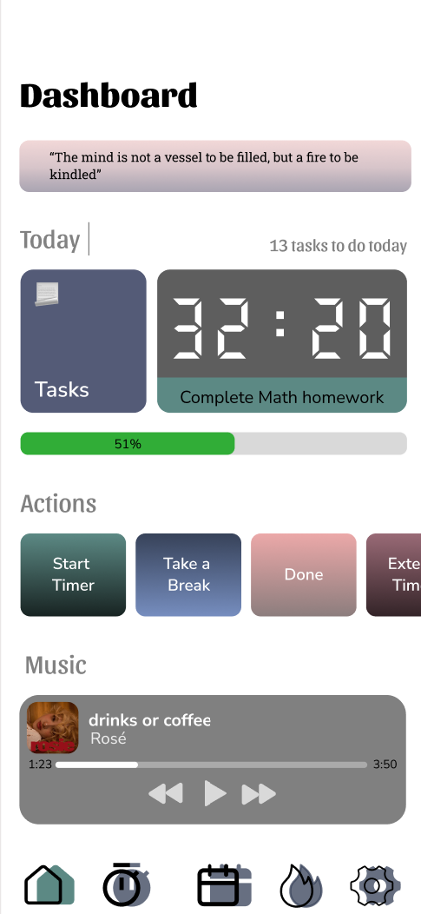
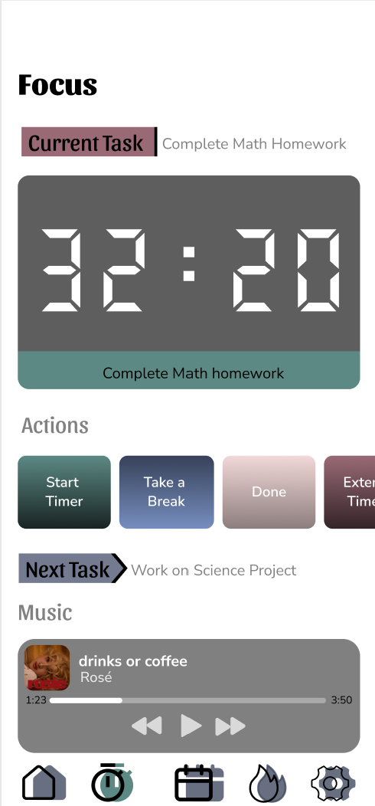
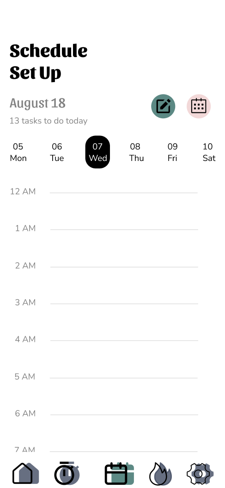
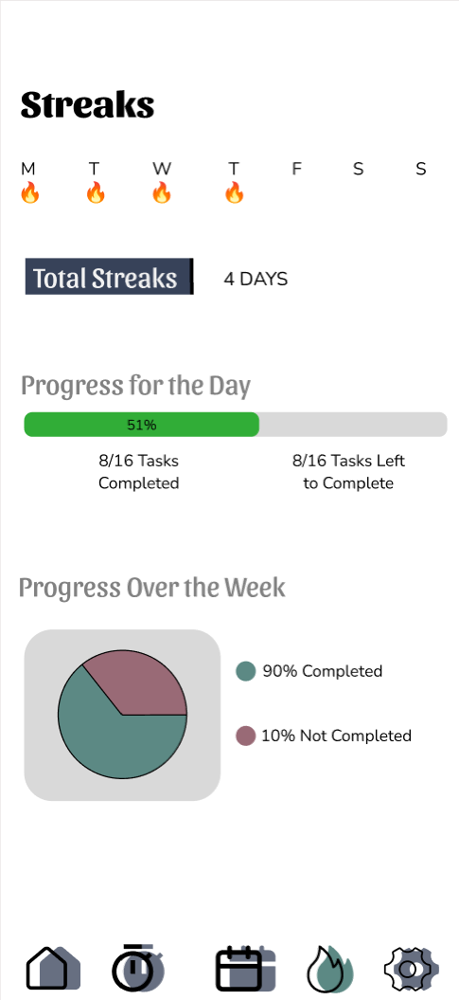
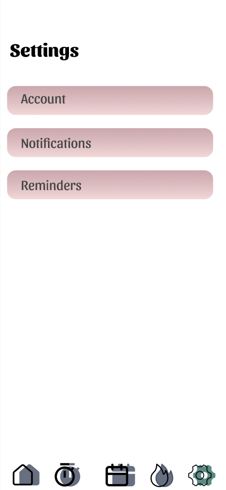

# 📌 Productivity App - Cerebliss

## 📒 Description

Cerebliss is a task-focused time management app designed to help users stay productive and organized by breaking their day down into small chunks of work. Each task includes a countdown timer to allow the user to stay engaged. The app includes flexibility, allowing users to adjust schedules, take breaks, and extend task durations as needed. Additionally, game-type features such as streaks and progress charts would make the productivity feel rewarding.

## 📚 Table of Contents
-   [Description](#-description)
-   [Current Status](#-current-status)
-   [Technologies Used](#-technologies-used)
-   [Key Features](#-key-features)
-   [Screenshots](#screenshots)
-   [How to Build/Run the Project](#️-how-to-buildrun-the-project)
-   [Todo](#-todo)
-   [Comments](#-comments)
-   [Files and Folders](#️-files-and-folders)
-   [Author](#️-author)

## 🚧 Current Status

**Work in Progress**

This project is currently under development. I'm actively working on improving and exapanding it. As a result, some functionalities are incomplete.

## 💻 Technologies Used

-   JavaScript, React Native, Figma, ExpoGo
-   This project uses the [Advice Slip](https://api.adviceslip.com/advice) to display random quotes.

## 💡 Key Features

The key features and the core functionalities are described below:

1.  **Scheduling Feature:** Create a full study schedule for the day or the week, including specific times and durations for each task.
2.  **Countdown Timer:** Customizable countdown timer that is associated with each task, which could be extended as needed.
3.  **Break Feature:** A pause and resume function that can be used while completing a task or after finishing one.
4.  **Notification Feature:** Sends notification a few minutes before the next task starts, when a break ends, or when the daily goal is reached.
5.  **Visualization Chart:** Visual representation of the productivity. Shows the percentage of completed tasks compared to the initially scheduled tasks for the day.
6.  **Streak Feature:** Tracks productivity streaks throughout the week when the user remains consistently productive. A streak is lost if the percentage of completed tasks falls below a certain percentage.
7.  **Music Player:** Using the Spotify API, users can connect to their account and play songs within the application. Displays the song title, artist name, a basic control features, such as pause, play, and skip.
8.  **Compete with Friends:** Users can add friends and compete in completing tasks. At the end of each schedule, the app displays who was more productive.

## 🖼️ Screenshots







## 🛠️ How to Build/Run the Project

**Cloning the Repository**

The following steps are done from the command line to clone the repository:

1.  Clone the repository using GH CLI:

    ``` bash
    gh repo clone sona-james/productivity-app
    ```

2.  Navigate into the cloned repository:

    ``` bash
    cd sona-james/productivity-app
    ```


## 📝 Todo

-   Implement the music player using spotify API.
-   Turn the dates on the schedule page to button type and add the highlight feature.
-   Implement the features inside each modal and pressable.
-   Work on the navigation.

## 💬 Comments

I shared this project early to showcase the work I have done so far and to document my progress.

## 🗃️ Files and Folders

-   *./reports* - contains the project scaffold.

    -   *report.qmd* - the QMD file contains more descriptions of the project.

    -   *report.html* - this file is the rendered HTML version of the report QMD file.

-   *./assets* - contains the images used in this project


## 🙆‍♀️ Author

[\@sona-james](https://github.com/sona-james)
